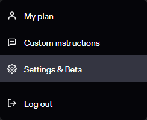

# Your entire ChatGPT data in beautiful Markdown 

Welcome to the ChatGPT Conversations to Markdown converter! This Python script helps you to convert your entire ChatGPT history and data export into neatly formatted Markdown files.

It adds **YAML** headers (*optional, included by default*), and also includes **Code interpreter** (Advanced Data Analysis) input / output.


#### See Examples : [Screenshot](demo/Fibonacci.png), [Markdown](demo/Fibonacci.md), [Markdown with dollar signs](demo/Fibonacci-dollar-signs.md), [Chat link](https://chat.openai.com/share/27b6df58-a590-41ac-9eff-f567602fe692).

## Quick setup

> See [Prerequisites](#prerequisites). (just Python and Git and you're good to go. **No external dependencies !**)

### Step 1: Clone the Repository 📥

Open a terminal or command prompt and run the following command:

```bash
git clone https://github.com/mohamed-chs/chatgpt-history-export-to-md.git
```

Next, navigate to the project directory by using the following command:

```bash
cd chatgpt-history-export-to-md
```

### Step 2: Download Your Conversations data 🗂

Before you run the script, make sure your ChatGPT conversations are in a ZIP file format.

<details>
  <summary>Click to EXPAND instructions :</summary>
  
  1.  Sign in to ChatGPT at https://chat.openai.com

2.  At the bottom of the left side bar, click on your profile name, the on **Settings**

    

3.  Go to **Data controls**

    

4.  In the "Data Controls" menu, click on _Export data_ : **Export**

    

5.  In the confirmation modal click **Confirm export**

    

6.  You should get an email with your data, in 2 ~ 5 minutes (check your **inbox**)

    

7.  Click **Download data export** to download a `.zip` file containing your entire chat history and other data.

    

</details>

>

The script will automatically find the most recent ZIP file in your 'Downloads' directory (in `~/Downloads/`), but you can specify a different file or location if necessary.

### Step 3: Running the Script 🏃‍♂️

In the terminal or command prompt, run the script with this command:

```bash
python main.py
```

The default output location for the Markdown files is : `~/Documents/ChatGPT-Conversations/MD/`. The script will automatically create the directories if they didn't exist. Feel free to [customize](#optional-customize-the-scripts-behavior-🌟) the script's behavior.

### Step 4: Check the Output 🎉

And that's it! After running the script, check the output folder for your neatly formatted Markdown files.

### Optional: Customize the Script's behavior 🌟

#### command line parameters

Feel free to customize the script's behavior using additional parameters:

- `--out_folder`: Specify the output folder where the MD files will be saved.
- `--zip_file`: Specify the ZIP file containing the ChatGPT conversations to be converted.

Here is an example command:

```bash
python main.py --out_folder "Obsidian_Vault/Chats" --zip_file "My downloads/my_chat.zip"
```

This will extract and look for the `conversations.json` file in `~/My downloads/my_chat.zip`, and create the MD files in `~/Obsidian_Vault/Chats`.

(on **Windows**, `~/` refers to `C:/Users/{your_username}/`).

#### `config.json`

You can also modify the [config.json](config.json) file, to customize the output :

```json
{
  "system_title": "System",
  "user_title": "YOUR NAME",
  "assistant_title": "My AI",
  "tool_title": "Code output",
  "delimiters_default": true
}
```

Change `"delimiters_default"` to `false` to replace all $\LaTeX$ bracket delimiters : `\(...\)` and `\[...\]`, with dollar sign ones : `$...$` and `$$...$$`, if you'd like your math to render beautifully in Markdown readers that support **MathJax** (like Obsidian).

You can also configure the YAML header in the `config.json` to add or remove fields.

### Issues and contributions 🆘

Feel free to fork this repository and make your enhancements or improvements. ALL contributions are welcome !

If you encounter any issues or have questions, feel free to open a discussion [here](https://github.com/mohamed-chs/chatgpt-history-export-to-md/issues) or leave a comment on the Reddit post [here](https://www.reddit.com/r/ChatGPT/comments/16k1ub5/i_made_a_simple_chatgpt_history_to_markdown/).

### Enjoy Your Conversations in Markdown! 🎈

Hopefully, you find value in this tool. If you do, giving it a star ⭐ on the repository would mean a lot. Thank you!

### Prerequisites

 

Make sure you have **Python** (version >= 3.10), and **Git** installed.
You can download them from :

- [Official Python website](https://www.python.org/downloads/)
- [Official Git website](https://git-scm.com/downloads)

Yep, no external dependencies needed.

### Notes

This is just a small thing I coded to help me see my convos in beautiful markdown, in [Obsidian](https://obsidian.md/) (my note-taking app).

I wasn't a fan of the clunky, and sometimes paid, chrome extensions.

I'm working on automating it to add new conversations and updating old ones. Had some luck with a JavaScript bookmarklet, still ironing it out tho. Shouldn't take long.
