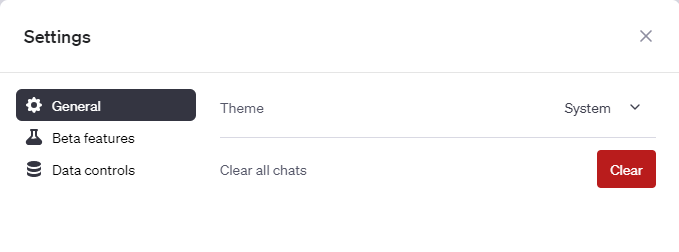
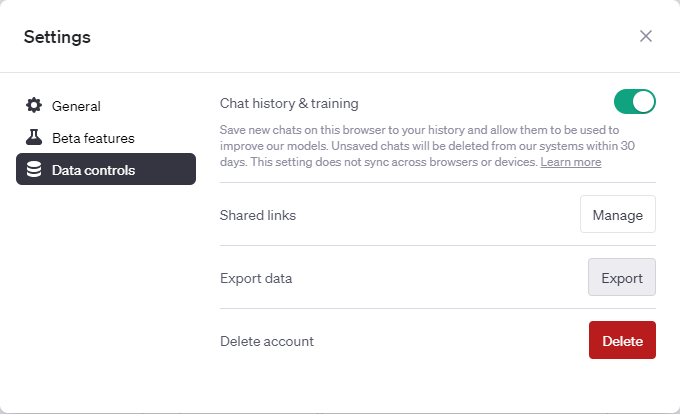
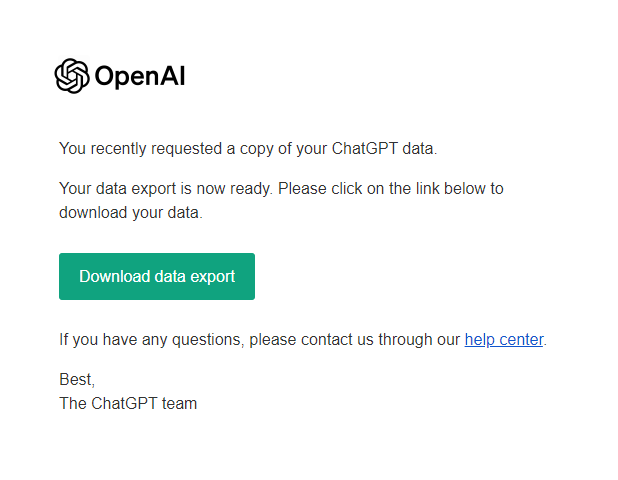
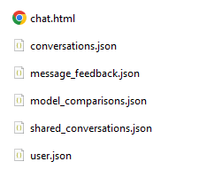

# Your entire ChatGPT data in beautiful Markdown 

## You can now try out Word Clouds 🔡☁️ on your data !


Welcome to the ChatGPT Conversations to Markdown converter! This Python script helps you to convert your entire ChatGPT history and data export into neatly formatted Markdown files.

It adds **YAML** headers (_optional, included by default_), and also includes **Code interpreter** (Advanced Data Analysis) input / output.


#### See Examples : [Screenshot](demo/Fibonacci.png), [Markdown](demo/Fibonacci.md), [Markdown with dollar signs](demo/Fibonacci-dollar-signs.md), [Chat link](https://chat.openai.com/share/27b6df58-a590-41ac-9eff-f567602fe692).

## Quick setup

> See [Prerequisites](#prerequisites). (just Python and Git and you're good to go.)

### Step 1: Clone the Repository 📥

Open a terminal or command prompt and run the following command:

```bash
git clone https://github.com/mohamed-chs/chatgpt-history-export-to-md.git
```

Next, navigate to the project directory by using the following command:

```bash
cd chatgpt-history-export-to-md
```

### Step 2: Set Up the Environment 🛠️

Before running the script, you need to set up a virtual environment and install the required dependencies.

First, create a virtual environment:

```bash
python -m venv .venv
```

Activate the virtual environment:

- On Windows:

```bash
.venv\Scripts\activate
```

- On Linux or MacOS:

```bash
source .venv/bin/activate
```

Now, install the necessary packages using:

```bash
pip install -r requirements.txt
```

### Step 3: Download Your Conversations data 🗂

Before you run the script, make sure your ChatGPT conversations are in a ZIP file format.

<details id="download-instructions">
  <summary>How to download : (click to expand/collapse)</summary>

<hr>
  
1.  Sign in to ChatGPT at https://chat.openai.com

2.  At the bottom of the left side bar, click on your profile name, the on **Settings**

    

3.  Go to **Data controls**

    

4.  In the "Data Controls" menu, click on _Export data_ : **Export**

    

5.  In the confirmation modal click **Confirm export**

    

6.  You should get an email with your data, in 2 ~ 5 minutes (check your **inbox**)

    

7.  Click **Download data export** to download a `.zip` file containing your entire chat history and other data.

    

    [↑ Collapse](#download-instructions)

</details>

<hr>

The script will automatically find the most recent ZIP file in your 'Downloads' directory (in `~/Downloads/`), but you can specify a different file or location if necessary.

### Step 4: Running the Script 🏃‍♂️

With the environment set up, you can now run the script. In the terminal or command prompt, execute:

```bash
python main.py
```

Now, follow the instructions on screen and choose your desired options, the script will handle the rest.

### Step 5: Check the Output 🎉

And that's it! After running the script, head over to the output folder to see your neatly formatted Markdown files.

[](https://twitter.com/intent/tweet?text=So%2C%20this%20is%20what%20my%20entire%20ChatGPT%20history%20looks%20like%20...%0D%0A%0D%0Aby%20%40theSoCalled_%20on%20GitHub%20%3A%20http%3A%2F%2Fbit.ly%2F3ZuHCCK)

- [ ] a tweet should be fun when I later add the actual data visualizations. Feel free to implement your own data visualizations [here](src/data_visualization.py), and create a pull request, then check this box (I know you want to)

### Optional: Customize the Script's behavior 🌟

Using the `config.json`, you can modify the script's default parameters.

For example, set `"delimiters_default"` to `false` to replace all $\LaTeX$ bracket delimiters : `\(...\)` and `\[...\]`, with dollar sign ones : `$...$` and `$$...$$`, if you'd like your math to render beautifully in Markdown readers that support **MathJax** (like Obsidian).

### Acknowledgements 🌟

Big love to the following libraries that jazzed up this project!

- **[matplotlib](https://github.com/matplotlib/matplotlib)**: For making my data jump into vibrant visualizations. Art meets science, indeed! 📊

- **[nltk](https://github.com/nltk/nltk)**: Unpacking the magic of language has never been smoother. You're the NLP MVP! 📖

- **[prompt_toolkit](https://github.com/prompt-toolkit/python-prompt-toolkit)**: Command-line interfaces got a whole lot cooler with you. Kudos! 💻

- **[questionary](https://github.com/tmbo/questionary)**: For making CLI interactions fun and intuitive. Here's to engaging conversations! 💬

- **[wordcloud](https://github.com/amueller/word_cloud)**: Thanks for the visual treat with those playful word clouds. Text never looked better! ☁️

Major kudos to the developers and contributors. Your tools made this project shine! 🚀

### Issues and contributions 🆘

> See [CONTRIBUTING.md](CONTRIBUTING.md).

Feel free to fork this repository and make your enhancements or improvements. ALL contributions are welcome !

If you encounter any issues or have questions, feel free to open an [issue](https://github.com/mohamed-chs/chatgpt-history-export-to-md/issues) / [discussion](https://github.com/mohamed-chs/chatgpt-history-export-to-md/discussions).
See also : [HN post](https://news.ycombinator.com/item?id=37636701).

### Enjoy Your Conversations in Markdown! 🎈

Hopefully, you find value in this tool. If you do, giving it a star ⭐ on the repository would mean a lot. Thank you!

### Prerequisites

 

Make sure you have **Python** (version >= 3.10), and **Git** installed.
You can download them from :

- [Official Python website](https://www.python.org/downloads/)
- [Official Git website](https://git-scm.com/downloads)

Yep, no external dependencies needed.

### TODO

Doing what needs to be done.

Feel free to add or check items.

**general**

- [x] keep external dependencies to a minimum (0 so far)
- [x] Javascript to download more conversations, see [Javascript](javascript)
- [ ] Add new downloaded conversations to the MD folder
- [ ] Update past conversations if changed
- [ ] More robust testing setup
- [ ] Data visualizations : chat times, frequency, models, word clouds, etc...
- [ ] Data analysis : categories and more classifications based on topics, concepts, programming tools, etc ...
- [ ] Integration with Obsidian (folders and subfolders, tags, ...)
- [ ] Add HTML as an output option
- [ ] Format more content data, for example : plugin use
- [ ] Support different response selections in a chat
- [ ] Extract more data from the JSON files, like user feedback per message
- [ ] Option to add metadata for each individual message
- [ ] more todos ...

**command line**

- [ ] Nicer command line output formatting
- [ ] More configs from the command line (overwrite the config.json)
- [ ] Link to submit issues or feedback
- [ ] more todos ...

**configs.json**

- [x] change user, assistant, and system names
- [x] yaml header elements
- [ ] specific configs for each individual conversation / conversation type
- [ ] output folder (currently set by default or via command line arguments)
- [ ] more configs ...

> See also : [JavaScript Todo](javascript/how_to_use.md#still-working-on)

### Notes

This is just a small thing I coded to help me see my convos in beautiful markdown, in [Obsidian](https://obsidian.md/) (my note-taking app).

I wasn't a fan of the clunky, and sometimes paid, chrome extensions.

I'm working on automating it to add new conversations and updating old ones. Had some luck with a JavaScript bookmarklet, still ironing it out tho. Shouldn't take long.
